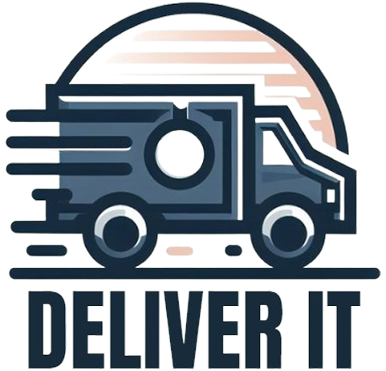

    

<h1 align="center">Deliver'it</h1>

Your professional VRP solution

---

## About the project

Deliver'it is a web application to help you manage your deliveries and routes in France.
It is a solution for VRP (Vehicle Routing Problem) that allows you to create, edit and
visualize your deliveries and routes in a map.

- 🚚 Create and customize your truck fleet
- 📦 Bin packing to put packages in trucks
- 📍 Pick one or more starting city
- 🚩 Pick delivery cities
- 🛰️ Routes based on real road data
- 🗺️ Real 3D map visualization
- 🎥 View your trucks on the road in real time
- ♾️ High number of trucks and packages supported

---

## Repository organisation

- `/backend`: Python backend, with a Flask API
  - Serves the frontend in production
  - Handles the VRP solving
  - Handles the bin packing
  - Handles the city search
- `/frontend`: Svelte frontend
  - User interface
  - Map visualization with mapbox
  - Instances creation and edition
  - API calls to the backend
- `/notebooks`: Jupyter notebooks
  - [Deliverable 1](./notebooks/deliverable-1.ipynb): Project definition, constraints, first mathematical models
  - [Deliverable 2](./notebooks/deliverable-2.ipynb): Constraints, VRP and bin packing algorithms, statistical analysis
  - [Cities generation](./notebooks/cities-generation.ipynb): Generation of cities GeoJson, currently stored in [/backend/resources/cities.geojson](./backend/resources/cities.geojson)
- `/.github/workflows`: GitHub actions
  - `back-build.yml`: Build and test the python backend
  - `front-build.yml`: Build and test the svelte frontend

---

## Contributors

This project is a school project from 4 [CESI](https://www.cesi.fr/) students :
- [BESSOT Quentin](https://github.com/QuentinBessot)
- [DENNI Raphaël](https://github.com/raphaeldenni)
- [PINHEIRO CRUZ Matthis](https://github.com/Matth2A)
- [WOLFF Julien](https://github.com/julien-wff)

---

## Screenshots

https://github.com/deliverit-soft/deliverit/assets/50249422/a6f16712-c1b7-4f3e-a889-4bb9b9622f1b

